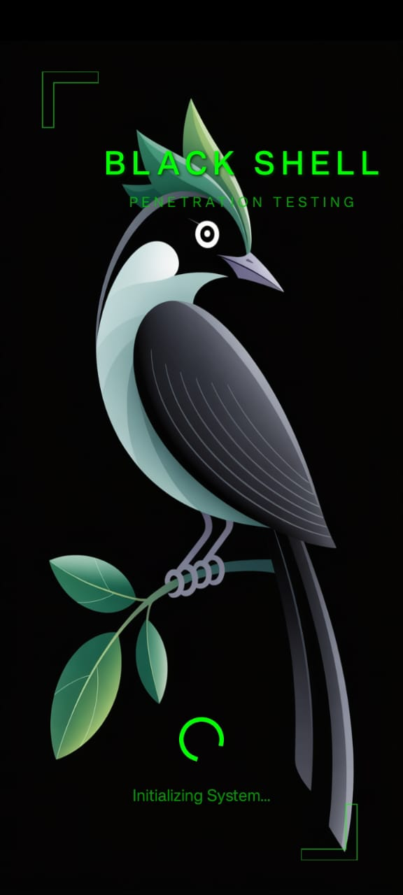
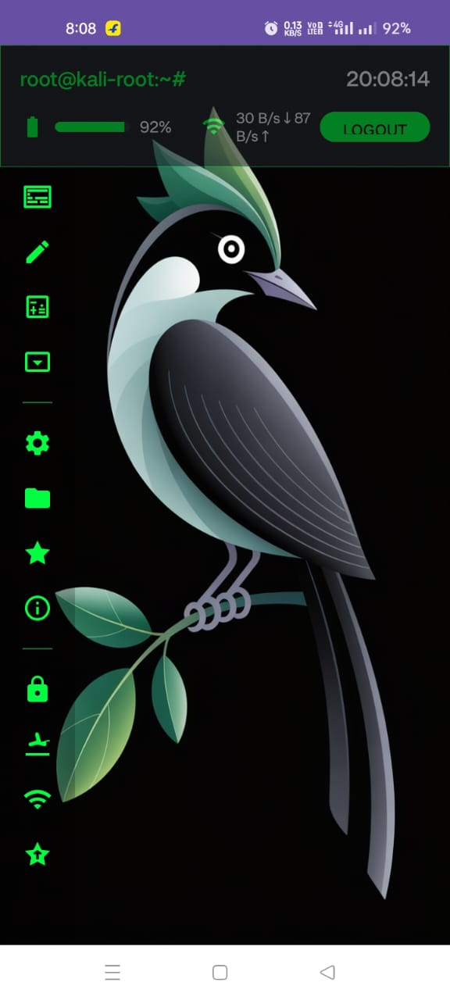
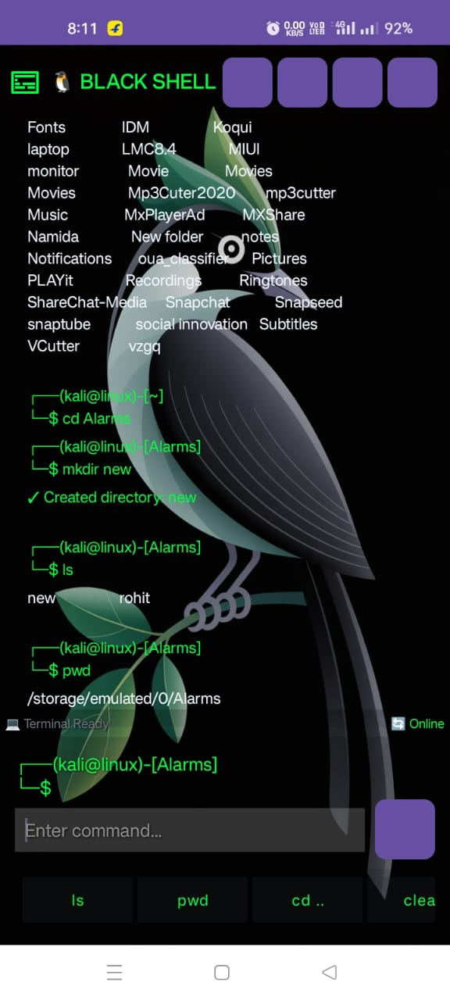
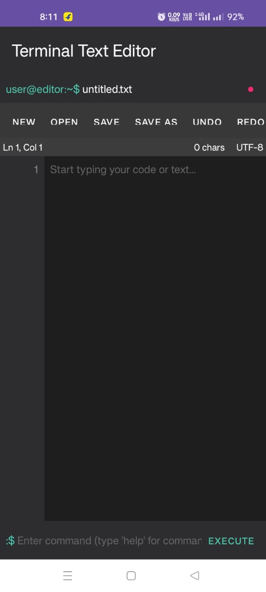
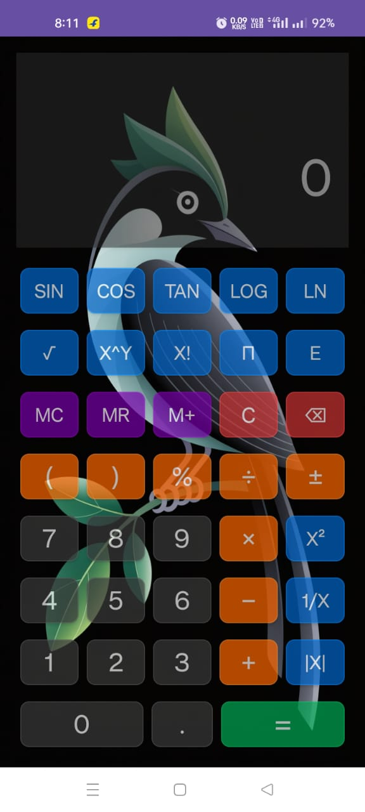
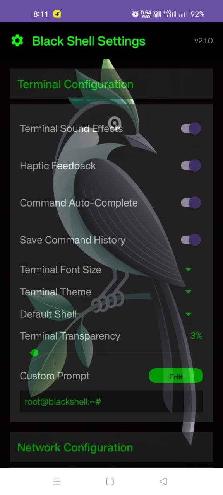
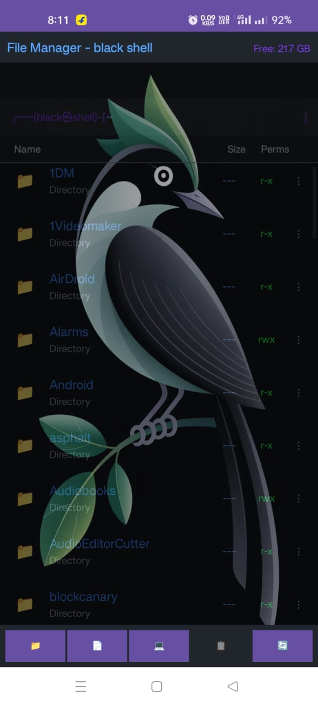
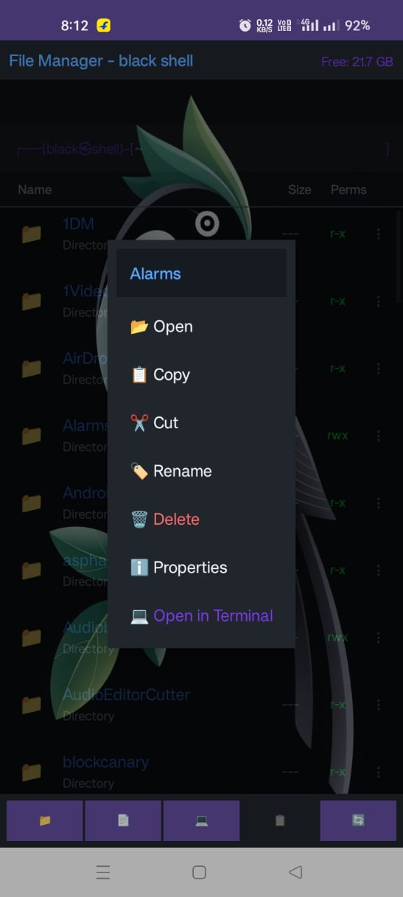

# 🐧 Black Shell - Linux Simulator Android App

**Black Shell** is an Android application that simulates a full-fledged Linux terminal experience, offering an immersive command-line interface on mobile devices. It supports essential Linux commands and tools like Git, SSH, and includes utilities such as a text editor, file manager, calculator, and more.

---

## 📸 Screenshots
- Here are few screenshots of ui off the app

| System Init | Sign In | Home |
|-------------|---------|------|
|  |  |  |

| Terminal | Text Editor | Calculator |
|----------|--------------|------------|
|  |  |  |

| Settings | File Manager | Options |
|----------|---------------|---------|
|  |  |  |

---

## 🚀 Features

- Simulated Linux terminal with real command execution
- Git support using JGit
- SSH integration
- Text/code editor with syntax awareness
- File manager mimicking Linux file system
- Calculator and settings interface
- Mobile-optimized UI for touch interaction

---

## ⚙️ Tech Stack

- **Java** (Android)
- **Room DB** for local storage
- **Jetpack** components
- **JGit** for Git support
- **Custom Terminal UI**
- **File I/O and system simulations**

---

## 📲 How to Use

1. Clone the repo
2. Open in Android Studio
3. Build and run on an emulator or physical device
4. Use terminal commands just like a Linux shell

---

## 📁 Repository

🔗 GitHub: [https://github.com/Rohitrrr384/Black-Shell](https://github.com/Rohitrrr384/Black-Shell)

---

---

## 💻 Available Commands in Black Shell Terminal

Black Shell supports a wide range of commands to simulate a real Linux terminal experience, categorized below:

---

### ✅ Common Linux Commands

| Command        | Description                            |
|----------------|----------------------------------------|
| `ls`           | List directory contents                |
| `cd`           | Change directory                       |
| `pwd`          | Print working directory                |
| `mkdir`        | Create new directory                   |
| `touch`        | Create a new file                      |
| `rm`           | Remove files or directories            |
| `cp`           | Copy files or directories              |
| `mv`           | Move or rename files                   |
| `cat`          | Display file content                   |
| `nano`, `vim`, `edit` | Open file in text/code editor       |
| `chmod`        | Change file permissions                |
| `find`         | Search for files in a directory        |
| `grep`         | Search inside files using patterns     |
| `ps`           | Display running processes              |
| `kill`         | Terminate a running process            |
| `clear`        | Clear the terminal screen              |
| `help`         | Show help message                      |
| `whoami`       | Show current user                      |
| `date`         | Display system date and time           |
| `echo`         | Print text to terminal                 |
| `history`      | Show command history                   |
| `su`           | Switch user                            |
| `sudo`         | Run command as superuser               |
| `env`          | Display environment variables          |
| `which`        | Locate a command binary                |
| `man`          | Show manual page for commands          |
| `tree`         | Display directory tree structure       |
| `head`         | Show first lines of a file             |
| `tail`         | Show last lines of a file              |
| `wc`           | Word, line, and byte count of a file   |
| `df`           | Show disk space usage                  |
| `free`         | Display memory usage                   |
| `uname`        | Show system information                |
| `exit`         | Exit the terminal                      |
| `wifi-scan`    | Scan and list available Wi-Fi networks |
| `bpad.txt`     | Open a notepad-like file for editing   |

---

### 🔐 SSH Commands

| Command             | Description                              |
|---------------------|------------------------------------------|
| `ssh`               | Connect to a remote server via SSH       |
| `ssh-list`          | List saved SSH connections               |
| `ssh-sessions`      | Show active SSH sessions                 |
| `ssh-disconnect`    | Disconnect an active SSH session         |
| `ssh-add`           | Add new SSH credentials                  |
| `ssh-toggle`        | Enable or disable SSH mode               |

---

### 🌱 Git Commands

| Command         | Description                                  |
|------------------|----------------------------------------------|
| `git`            | Git command entry point                     |
| `git help`       | Show available Git operations               |
| `git init`       | Initialize a new Git repository             |
| `git clone`      | Clone a remote repository                   |
| `git status`     | Show status of working directory            |
| `git add`        | Stage changes for commit                    |
| `git commit`     | Commit changes                              |
| `git push`       | Push commits to remote repository           |
| `git pull`       | Fetch and merge remote changes              |
| `git log`        | Show commit history                         |

> 🔧 Most Git commands are internally handled using JGit in the backend.

---

### 🧭 Tip:
You can always type `help` in the terminal to list available commands.

---

## ⭐ Give it a star if you liked the project!

